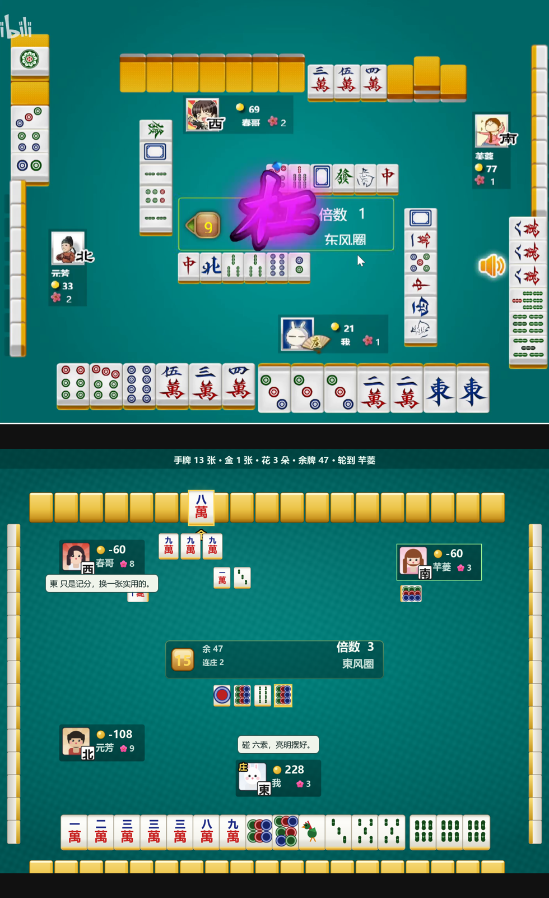
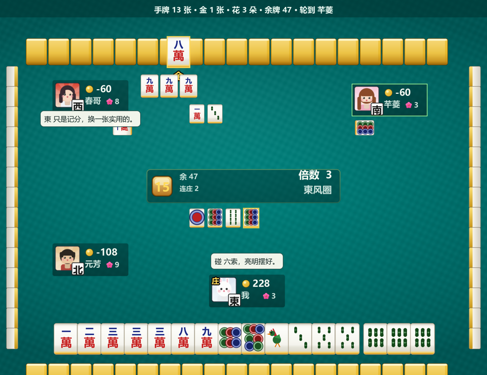
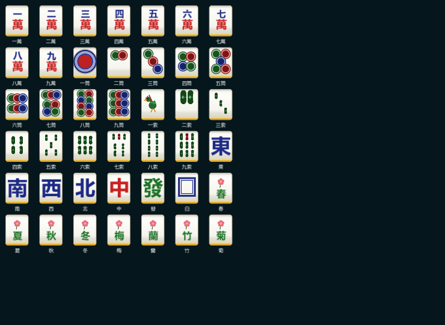

# 福州麻将 · 单机版 2D（Godot 4.7）

用 Godot 4.7 实现的 **福州麻将** 单机 2D 游戏。
素材与桌面布局参照 B 站实机录像 `BV1Ft1eYQE6A`（4399《福州麻将》）逐帧测量后程序化重绘；
规则以《福州麻将游戏规则》（新修订）为准。

流程：**开始场景（主菜单）→ 牌桌（一圈 4 局）→ 总结算场景**；
牌面 / 音效全部由代码程序化生成（`glyphs.gd` / `sfx.gd`），不依赖外部素材。



---

## 1. 快速运行

```bash
godot --path . --import     # 首次导入素材
godot --path .              # 运行（进入主菜单）

# 规则 / 牌局 / 术语 / 音效 / 场景单元测试（5864 项断言）
godot --headless --path . --script tests/test_rules.gd
# 交互自测（模拟真实鼠标：选牌 → 出牌 → 碰 → 结算 → 准备）
godot --path . scenes/Main.tscn -- --selftest
# 无人值守自动对局压测
godot --headless --path . scenes/Main.tscn --fixed-fps 30 -- --auto --exit-after 24000
```

> 带 `--shot / --auto / --selftest / --state` 等开发参数时，开始场景会自动直通牌桌。
> 单独预览菜单：`godot --path . scenes/Start.tscn -- --menu`。

### 操作

| 操作 | 说明 |
| --- | --- |
| 左键点手牌 | 选中（再点一次即打出） |
| 右键 / `Esc` | 取消选中 |
| `空格` / 「出牌」 | 打出选中的牌（未选中则打出刚摸的牌） |
| 中部按钮 | 吃 / 碰 / 杠 / 胡 / 过（限时 12 秒，超时自动「过」） |
| `H` | 玩法 + **福州麻将术语表** |
| `A` | 托管（AI 代打） |
| `T` | 透视对家手牌 |
| `W` | 直接和牌（调试） |

### 命令行（开发 / 验收）

| 参数 | 说明 |
| --- | --- |
| `--shot <path>` | 运行若干帧后截图并退出 |
| `--frames <n>` | 截图前等待帧数（默认 120） |
| `--auto` | 托管自动对局 |
| `--state claim\|win\|draw_game` | 强制进入某状态（截图验收） |
| `--hand13` | 改用 13 张手牌（参考实机的简化版；默认 16 张福州传统） |
| `--honors-tiles` | 切到实机变体：字牌不补牌，只有彩花 8 张补牌 |
| `--hands <n>` | 一圈局数（默认 4，即四家轮流坐庄） |
| `--help` | 启动即打开玩法说明（截图验收） |
| `--to-end` | 直接跳到总结算场景（验收） |
| `--selftest` / `--exit-after <n>` | 交互自测 / 运行 n 帧后退出 |

---

## 2. 福州麻将规则实现要点

| 规则 | 实现 |
| --- | --- |
| 144 张 = 万 / 筒 / 索 各 36 + 字牌 28 + 花牌 8（字牌与花牌只计分） | `tiles.gd` |
| 闲家 16 张 / 庄家 17 张（含**坎门**） | 默认 `hand_size = 16`（`--hand13` 可切到参考实机） |
| **补花**：摸到花牌和字牌必须亮出、从牌尾补，分轮进行 | `GameState._deal_flowers()` |
| **开金**：补完花后翻牌尾第一张非花牌为「金」（财神），可代任意牌 | `_open_joker()` / `Rules.can_hu(counts, jokers)` |
| **新摸进的牌不并入牌列**：单独摆在手牌右侧，出牌后才归位排序 | `GameState.drawn_index` / `merge_drawn()` / `TableView.self_slot_rects()` |
| 玩家思考时间：出牌 30 秒、吃碰杠胡 12 秒（已按需求翻倍） | `turn_limit` / `claim_limit` |
| 开金翻到**花牌**：该花归庄家 → 庄家补花 → 再翻金，仍是花则再补再翻 | `_open_joker()` / `_dealer_bonus_from_flower()` |
| 金移到**倒数第 9 墩**，随杠 / 补花前移 | `TableView._joker_target_pos()` |
| 吃 / 碰 / 杠（明杠・暗杠・**补杠**）/ 胡，优先级 胡 > 碰杠 > 吃 | `GameState._collect_claims()` / `_resolve_claims()` |
| **金牌不能打出**，也不能吃 / 碰 / 杠 / 和 | `GameState.discard()` / `_collect_claims()` / `TableView._hit_test()` |
| **截胡**：多人听同一张按逆时针最近者和，金雀除外 | `_resolve_claims()` |
| 特殊和牌（只算一种、就高计番）：三金倒 +10 / 抢金 +20 / 金雀 +30 / 天胡 +40 | `Rules.Win` + `Rules.WIN_FAN` + `_classify()` |
| **抢金**：开金翻出的金能直接胡时立即胡，优先于普通胡牌 | `_opening_best()` / `_opening_can_hu()` |
| **站顶**：第一次做庄胜的第一庄不算连庄番 | `dealer_tenure_wins` |
| **连庄**：胡牌或流局均连庄，庄家每连庄 +1 番 | `_finish()` / `_draw_game()` |
| 和局留 18 张，明杠 +1 / 暗杠 +2 | `required_reserve()` |
| 最后 4 张为「最后一组」，不补花不出牌，能和按自摸 | `_draw_last_group()` |
| 计分：`点炮底分=花番+金番+杠番+连庄番+特殊番`；`自摸=(花金杠连)×2+特殊番`；**三家同赔** | `Rules.settle_core()` |

> 计分要点：花番 = 每张花 +1，金番 = 每张金 +1，杠番 = 明杠 +1 / 暗杠 +2。
> 无论点炮还是自摸，三个输家都扣分，赢家得分为三家之和（`_finish()`）。

### 用牌构成（按新规则《用牌构成》）

| 组成 | 张数 |
| --- | --- |
| 万 / 筒 / 索：一~九 各 4 张 | 108 |
| 字牌：東 南 西 北 中 發 白 各 4 张（只计分） | 28 |
| 花牌：春 夏 秋 冬 梅 蘭 竹 菊 各 1 张（只计分） | 8 |
| **全副** | **144** |

* **默认**：字牌与花牌全部**只用作记分**、均触发补花，补花多轮后四家手牌只剩 **万 / 筒 / 索**。
* **`--honors-tiles`**：切到参考实机（4399）变体 —— 只把彩花 8 张当花牌，字牌留在手牌中可组刻子 / 将牌。
* 统一入口：`Tiles.is_flower(kind)`（36 张含字牌）/ `Tiles.is_paint_flower(kind)`（8 张彩花）/
  `Tiles.is_flower_in(kind, honors_as_flowers)`。

**开金遇到花牌**（按规则原文）：

> 如果开金时开出的为花，则算庄家的，为庄家补完花后，重新从牌尾翻开一张牌为金。

翻出花牌 → 该花归庄家 → 庄家从牌尾补花（补到非花为止）→ 再翻一张为金；
若仍是花则继续「补花 → 再翻金」循环，直到翻到非花。庄家因此多拿的牌，
在其首回合需要多打出同样多的张数，以恢复「和牌 17 张」的手牌张数不变式
（界面会提示「开金补花：还需打出 N 张」）。

---

## 3. 福州方言牌桌对话

每家的动作都会说一句福州话味的台词（`scripts/dialogue.gd`），以气泡显示在信息牌旁：



用到的百科术语（游戏内 `H` 键可查看完整术语表）：

| 术语 | 含义 | 触发时机 |
| --- | --- | --- |
| 金（ging55） | 财神，可代任意牌 | 开金 / 和牌 |
| 开金 | 补花后翻牌尾第一张定金 | 开局 |
| 补花 | 花牌从牌尾补抓 | 摸到花牌 |
| 坎门 | 庄家额外多拿的一张 | 开局（庄 17 张） |
| 企顶 / 站庄（kie53 ling33） | 庄家和牌后继续连庄 | 坐庄 |
| 截胡 | 多人听同一张，逆时针最近者胡 | 和牌 |
| 抢金（cuong21 nging55） | 开金翻出的金能直接胡即胡，+20 番 | 开局和牌 |
| 三金倒 / 三头金 | 集齐三张金即胡，+10 番 | 摸到 3 张金 |
| 金雀（ging53 cuok24） | 两金作将，+30 番；截和优先 | 和牌 |
| 天胡 | 庄家起手即胡，+40 番 | 开局 |
| 特殊牌型就高 | 三金倒 / 抢金 / 金雀 / 天胡同时成立时只算一种 | 和牌判定 |
| 甜（dieng55）/ daing242（硬） | 上家给的牌好 / 不好 | 吃牌 |
| 凑骹（cau55 ka55）/ 麻雀骹 | 三缺一 / 牌友 | 开局 |
| 二索（ni53 looh24）/ 二饼 / 八饼 | 二条 / 二筒 / 脸难看 | 闲聊 |
| 伓是亲戚，无拍三七 | 不轻易给下家好牌吃 | 听牌 |
| 转桌脚 / 脱裤子 / 买牌 / 麻将鬼 | 手气差时的民间讲究 | 落后时 |

---

## 4. 目录结构

```
project.godot               项目设置（1400×1080 画布，canvas_items / expand）
scenes/
  Start.tscn                开始场景（主菜单：开始 / 玩法 / 音效 / 退出）
  Main.tscn                 牌桌场景（Felt 背景 / Table 桌面 / HUD 界面层）
  End.tscn                  总结算场景（一圈排名 / 再来一圈 / 回主菜单）
  TileSheet.tscn            牌面总览场景（素材复核）
scripts/
  tiles.gd       Tiles       144 张牌定义、花牌双模式、牌墙生成
  rules.gd       Rules       和牌判定（含金替代 / 全对子型）、听牌、吃碰杠、番数计分
  rules_text.gd  RulesText   玩法 / 操作说明文本（牌桌帮助与主菜单共用）
  game.gd        GameState   牌局状态机（发牌·补花·开金·出牌·吃碰杠胡·AI·结算·台词触发）
  dialogue.gd    Dialogue    福州方言台词与术语表
  glyphs.gd      TileGlyphs  牌面绘制（万 / 筒 / 索 / 字 / 花）
  sfx.gd         Sfx         程序化音效（运行时合成 AudioStreamWAV，无外部音频）
  fonts.gd       GameFonts   系统中文字体工厂
  table.gd       TableView   桌面布局绘制、鼠标选牌、台词气泡、金牌位移
  hud.gd         HudLayer    动作按钮、结算面板、状态栏、帮助 + 术语表
  start_scene.gd             主菜单
  end_scene.gd               总结算
  match_summary.gd MatchSummary 跨场景成绩汇总
  main.gd                    牌桌入口、背景铺满、命令行开关
  tile_sheet.gd              42 张牌面对照表
tests/test_rules.gd         规则 / 牌局 / 术语 / 音效 / 场景 原生测试
tools/gen_assets.mjs        素材生成器（Node + zlib，超采样 SDF 软光栅 → PNG）
assets/generated/           生成的美术素材（PNG）
docs/                       规则映射、对照截图
```

---

## 5. 素材（assets/generated）

全部由 `tools/gen_assets.mjs` **程序化生成**（自写 PNG 编码器 + 超采样 SDF 光栅器），
不依赖任何外部图片库或下载素材：

| 文件 | 尺寸 | 用途 |
| --- | --- | --- |
| `felt.png` | 1920×1080 | 青色台呢（径向渐变 + 布纹 + 暗角） |
| `tile_back.png` | 72×96 | 金背牌（顶/底棱 + 高光 + 金色渐变） |
| `tile_blank.png` | 72×96 | 象牙白牌面（顶灰棱 → 白面 → 底灰棱 → 金边） |
| `wall_v.png` / `wall_v_mirror.png` | 34×62 | 纵墙侧面（象牙 + 金条，左右镜像） |
| `panel_center.png` / `panel_player.png` | 620×118 / 220×96 | 中央信息面板 / 玩家信息牌 |
| `btn_gold.png` / `btn_gold_hl.png` | 168×62 | 金色圆角按钮（常态 / 高亮） |
| `badge_gem.png` | 72×72 | 倒计时琥珀宝石 |
| `burst_magenta/cyan/gold.png` | 320×320 | 吃碰杠胡 / 和牌 呼叫光爆 |
| `icon_coin.png` / `icon_flower.png` / `wind_badge.png` | 32 / 34 / 56 | 铜钱分 / 花数 / 字风牌 |
| `avatar_me/zexu/baozhen/huiyin.png` | 84×84 | 四位角色头像（我 / 则徐 / 葆桢 / 徽因） |
| `glow_white/gold/green.png` | 128–160 | 柔光晕 |

重新生成：`node tools/gen_assets.mjs && godot --path . --import`

**牌面**（万 / 筒 / 索 / 字 / 花）不预烘焙，由 `scripts/glyphs.gd` 在 `_draw()` 中矢量绘制，
任意分辨率下都清晰；汉字字形来自系统中文字体（`SystemFont` 回退链）。

**音效**同样不依赖外部素材：`scripts/sfx.gd` 运行时用正弦 / 噪声 / 包络合成 13 种音效
（选牌、摸牌、出牌、吃碰杠、和牌、大牌、开金、补花、发牌、失败、点击），多路复用播放。



---

## 6. 验证记录

| 项目 | 命令 | 结果 |
| --- | --- | --- |
| 规则 / 牌局 / 术语 / 音效 / 场景单元测试 | `godot --headless --path . --script tests/test_rules.gd` | **5864 / 5864 通过** |
| 真实鼠标输入链路 | `scenes/Main.tscn -- --selftest` | **9 / 9 通过** |
| 自动对局压测 | `scenes/Main.tscn -- --auto --exit-after 9000` | **0 脚本错误** |
| 场景切换（牌桌 → 总结算） | `scenes/Main.tscn -- --to-end --shot out.png` | 正常 |

截图对照见 [`docs/compare/`](docs/compare/)：
`01_table_vs_reference` 桌面布局对照 · `02_call_buttons` 吃碰杠胡按钮 ·
`03_result_panel` 结算面板 · `04_tile_faces` 42 张牌面 ·
`06_dialogue` 福州方言牌桌对话。

---

## 7. 与原文/实机的差异（有意为之，全部可核对）

| 项 | 原文 / 实机 | 本作 | 原因 |
| --- | --- | --- | --- |
| 补花分轮 | 多轮直到无花 | 已按多轮实现（庄家为首、未补进花者跳过） | — |
| 金位 | 倒数第 9 墩，随杠/补花前移 | 已实现，沿横墙平滑滑动 | — |
| 开金翻到花牌 | 「算庄家的，为庄家补完花后重新翻金」 | **完整实现**：花归庄家 → 庄家补花（+1 张）→ 再翻金，循环 | 庄家多出的牌在首回合多打出同样张数，保持和牌 17 张不变式 |
| 全对子型 | 新规则只列了「5 组面子 + 1 对将」 | 保留全对子型可和 | 旧版已有、且不冲突，保留可玩性 |
| 对家手牌 | 实机部分帧显示明牌 | 默认隐藏，`T` 可透视 | 原版显示数量不稳定，隐藏更公平 |

> **已按新规则移除**：平和 / 平和一张花 / 金龙 特殊和牌、「打金后只能自摸」「闲金只能自摸」限制、
> 四同花额外留牌；抢金不再奖罚加倍（改为 +20 番）；计分改为三家同赔。

---

## 8. 来源

* 布局 / 配色 / 精灵造型参考：B 站 `BV1Ft1eYQE6A`（4399 福州麻将实机录像），
  仅作**逆向测量与风格参考**，所有素材均为本项目程序化重绘，未复制原版图片文件。
* 规则文本：《福州麻将游戏规则》（新修订）。
* 代码：项目内自行实现。

> `docs/compare/01_table_vs_reference.png` 为对照用的实机录像截图（B 站 `BV1Ft1eYQE6A`），
> 版权归原作者，仅作布局比对之用，**不随本项目代码一同授权**。

---

## 9. 许可证

本项目以 **MIT License** 开源，详见 [`LICENSE`](LICENSE)。
代码、文档与程序化生成的素材（`assets/generated/*.png`、`scripts/sfx.gd` 音效）均可自由使用、修改与分发。
